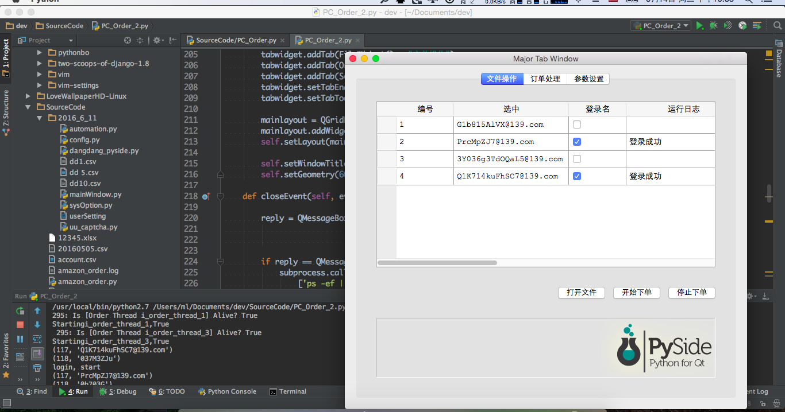
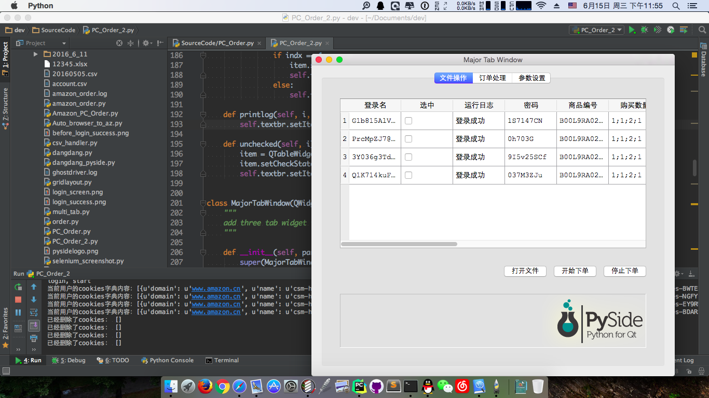
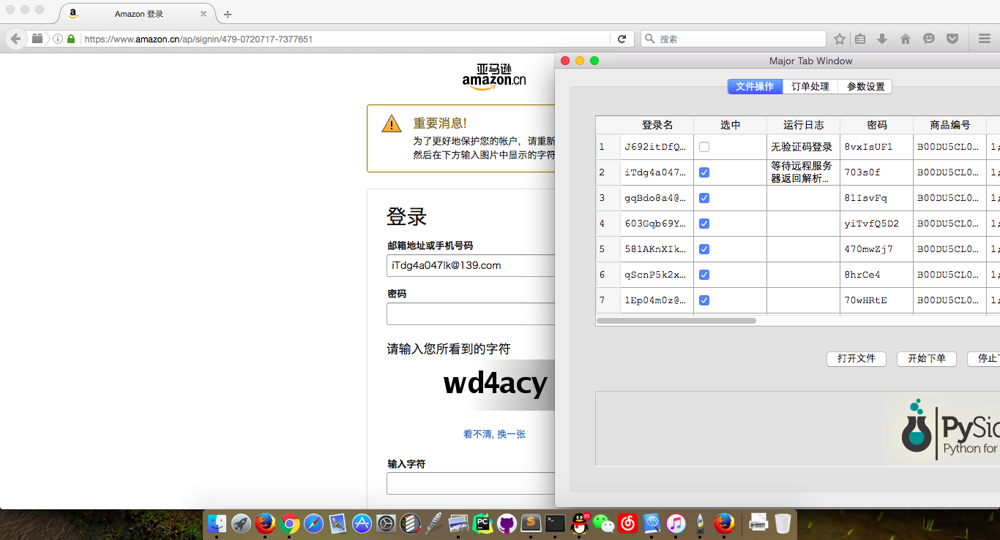

# PySide_For_Amazon_Order
亚马逊（中文）自动下单，使用PySide框架

本周（20160605）结果截图：  

20160607:  

  

20160607-pm:
`未能将下单程序放到线程中运行,同时无法打印日志`  

20160614-am:
`线程内运行make_order函数,但执行中途出现闪退`

20160614-am-2:
`使用模块级变量作为参数池, 成功打印日志, 和多线程`

20160614-pm:
`实现勾选后按照行数运行线程`

20160616-am:
`It can unchecked the item of current thread.`

20160621-pm:
`添加验证码处理，更新csv文件，但是UU打码平台目前只返回四位验证码，如下图：`

20160624-am:
`清空购物车和添加商品到购物车改为request直接发送HTTP请求，ToDo——设置收货地址和支付方式`
