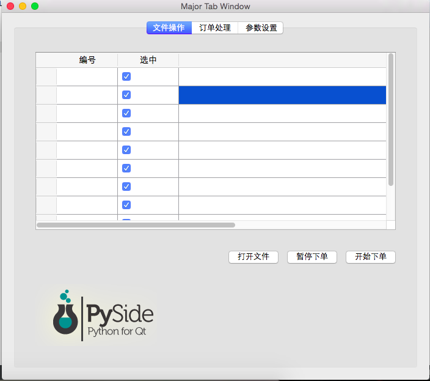
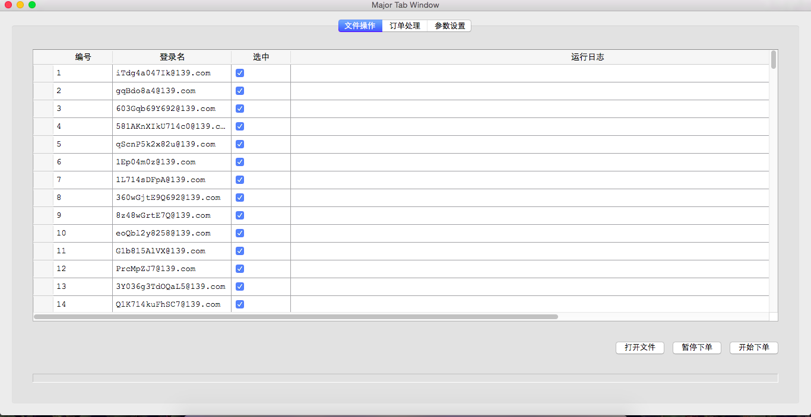
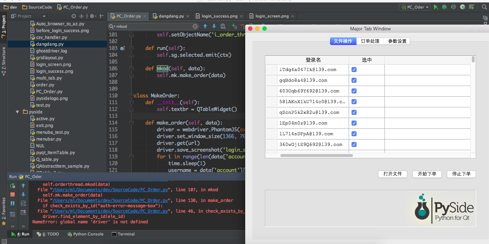
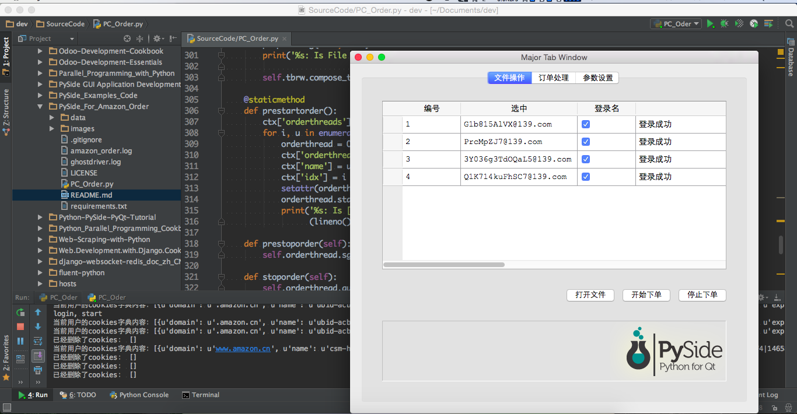

# PySide_For_Amazon_Order
亚马逊（中文）自动下单，使用PySide框架

本周（20160605）结果截图：  

20160607:  

  

20160607-pm:
`未能将下单程序放到线程中运行,同时无法打印日志`  

20160614-pm:
`线程内运行make_order函数,但执行中途出现闪退`

20160614-pm-2:
`使用模块级变量作为参数池, 成功打印日志, 和多线程`
